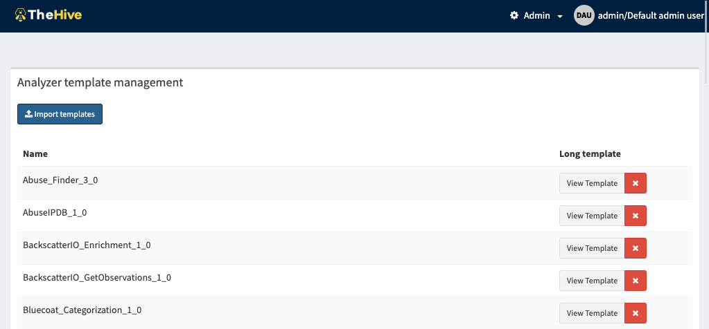
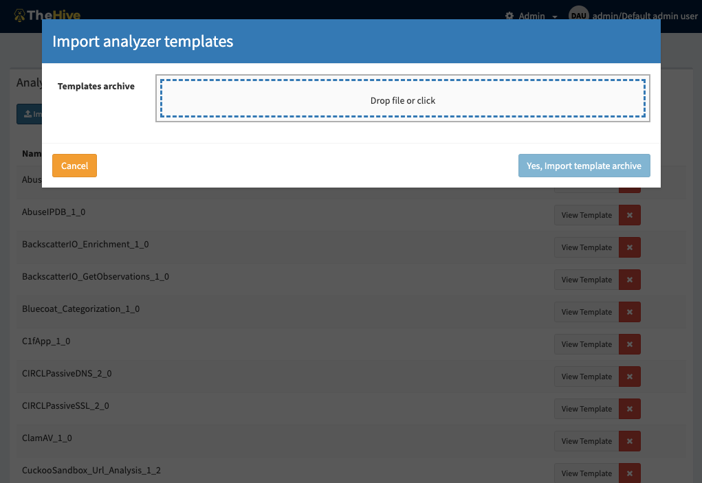

# Manage analyzer template

Before TheHive4, we used to call them *Report templates* and we allowed two types of templates:

- Short reports: used to customise the display of analysis report summary
- Long reports: used to customise the rendering of the raw report of a given analyzer report

Starting from TheHive4, short reports have been removed, and TheHive will display the analysis summary the same way for all analyzers: display a tag using taxonomies and level color.

## List analyzer templates

The management page is accessible from the header menu through the *Admin > Analyzer templates* menu and required a use with the `manageAnalyzerTemplate` permission (refer to [Profiles and permissions](./Profiles-permissions.md)).

Note that analyzer templates are global and common to all the organisations.

Analyzer templates are still customisable via the UI and can also be imported.

## Import analyzer templates

TheHive Project provides a set of analyzer templates (we use the same `report-templates.zip` archive for backward compatibility reasons).

The template archive is available at http://dl.bintray.com/thehive-project/binary/report-templates.zip

To import the zip file, click on the *Import templates*, this opens the import dialog. Drop the zip files or click to select it from your storage and finally click *Yes, import template archive*.

