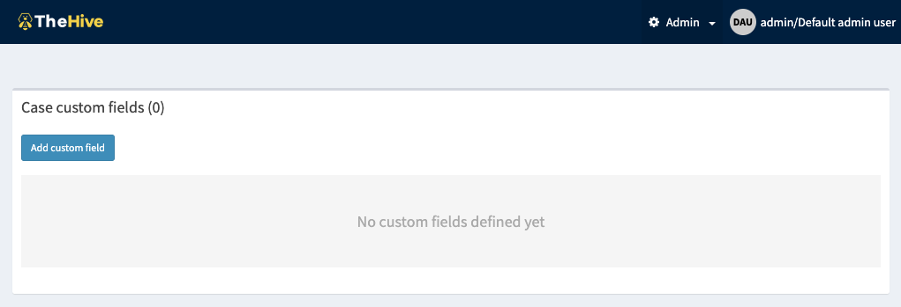
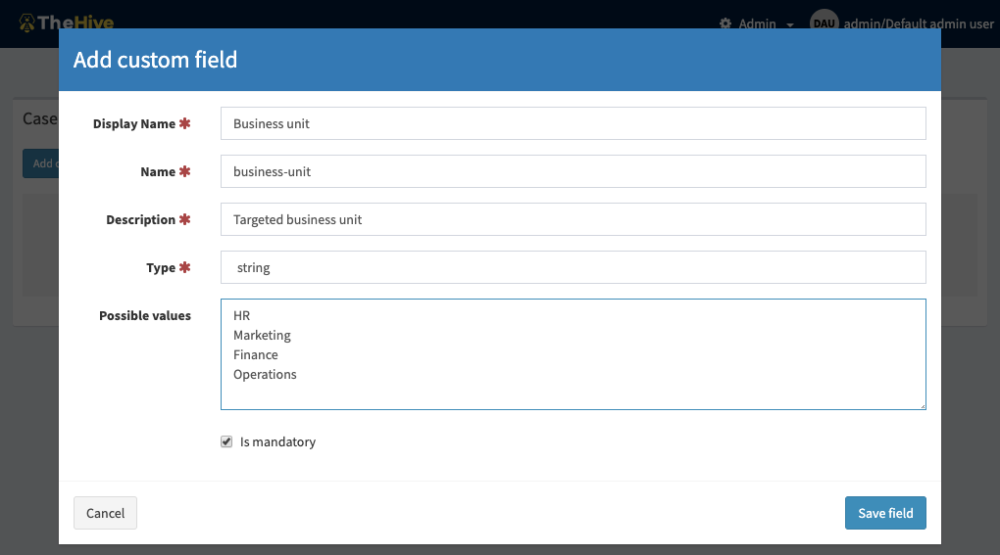
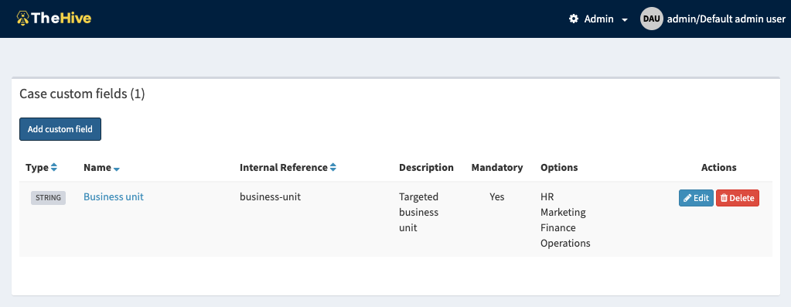
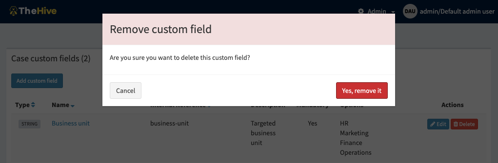

# Manage custom fields

In TheHive 4, *Metrics* have been removed. Why? Because metrics are simply, numeric custom fields.

To manage *Custom fields* you need to login as an *"admin"* user (Member of the *"admin"* organisation) that has a profile including the `manageCustomField` permission (refer to [Organisations, Users and sharing](./Manage-orgs-users.md#permissions)).

The default *"admin"* user has that permission.

Custom fields are global to all the organisation.

When installing TheHive, the list of custom fields is initially empty, administrators have to populate it. 

To create a custom field, click on the "Add custom field" button that opens a dialog:

You need to set:

- a display name
- a name (automatically pre-filled by the UI based on the display name)
- a description
- a type: on of `string`, `intger`, `booleen`, `date` and `float` (new type added by TheHive 4)
- possible values (not available for `date` and `boolean` fields)
- wether the field is mandatory or not (will be prompted when you close a *Case* without setting its value)

Once the custom field is created, you can edit its details or delete it:

Only unused custom fields can be removed:

