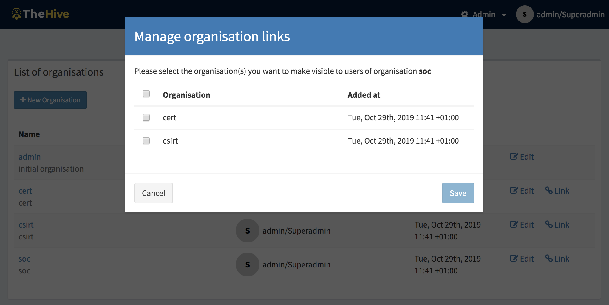
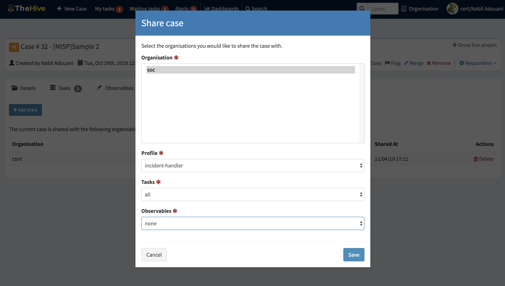
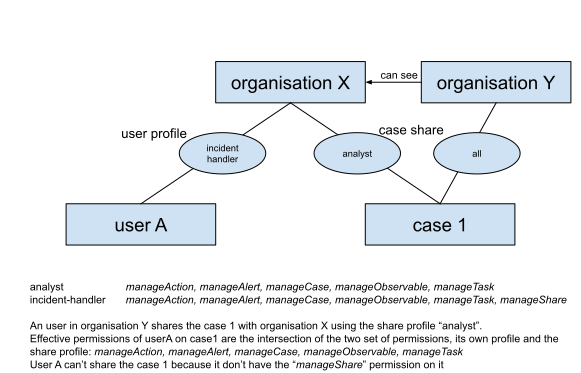
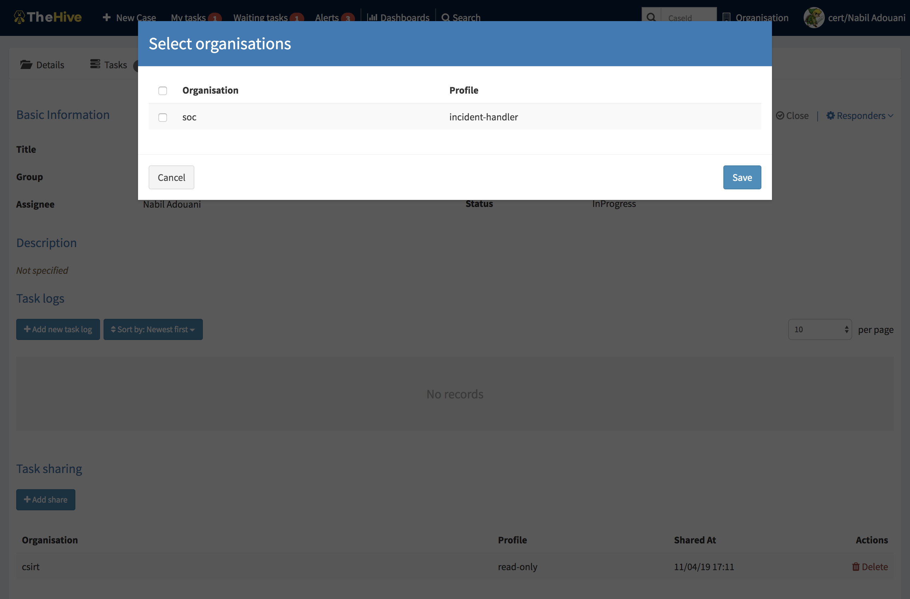
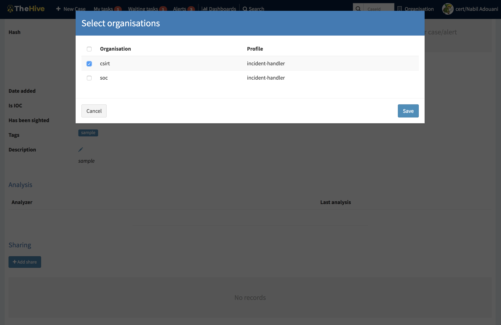

# Organisations, Users and sharing

## User role, profile and permission

### User

In TheHive, a user is a member of one or more organisations. One user has a profile **for each** organisation and can have different profiles for different organisations. For example:

- “*analyst*” in “*organisationA*”;
- and “*admin*” in “*organisationB*”;
- and “*read-only*” in “*organisationC*”.

### Permissions

A profile is a set of permissions attached to a user and an organisation. It defines what the user can do on an object hold by the organisation. TheHive has a finite list of permissions:

- **manageOrganisation** (1) : the user can *create*, *update* an organisation
- **manageConfig** (1): the user can *update* configuration
- **manageProfile** (1): the user can *create*, *update* and *delete* profiles
- ***manageTag*** (1): the user can *create*, *update* and *delete* tags
- **manageCustomField** (1): the user can *create*, *update* and *delete* custom fields
- **manageCase**: the user can *create*, *update* and *delete* cases
- **manageObservable**: the user can *create*, *update* and *delete* observables
- **manageAlert**: the user can *create*, *update* and *import* alerts
- **manageUser**: the user can *create*, *update* and *delete* users
- **manageCaseTemplate**: the user can *create*, *update* and *delete* case template
- **manageTask**: the user can *create*, *update* and *delete* tasks
- **manageShare**: the user can *share* case, task and observable with other organisation
- **manageAnalyse** (2): the user can *execute* analyse
- **manageAction** (2): the user can *execute* actions
- **manageAnalyzerTemplate** (2): the user can *create*, *update* and *delete* analyzer template (previously named report template)

(1) Organisations, configuration, profiles and tags are global objects. The related permissions are effective only on “admin” organisation.
(2) Actions, analysis and template is available only if Cortex connector is enabled

Read information doesn’t require specific permission. By default, users in an organisation can see all data shared with that organisation (cf. shares).

### Profiles

TheHive comes with default profiles but they can be updated and removed (if not used), except for “all”. New profile can be created.

If it is used, a profile can’t be remove but can be updated.

Default profiles are:

- **admin**: can *manage* all global objects and users. Can’t create case.
- **analyst**: can manage cases and other related objects (observables, tasks, …).
- **incident-handler**: like analyst but can *share* object with other organisation.
- **org-admin**: *all* permissions *except* those related to global objects
- **read-only**: *no* permission
- **all**: all permissions

## Organisations and sharing

TheHive comes with a default organisation named "admin" and is dedicated to users with administrator permissions of TheHive instance. This organisation is very specific so that it can manage global objects and cannot contain cases or any other related elements. 

By default, organisations can’t see each other, and can't share with any. To do so, an organisation must be "linked" with another one.  Only super administrators or users with **manageOrganisation** permissions can give the ability of a organisation to see an other one. This ability named “*link*” is unidirectional. 

### Link with other organisations

To share a case with another organisation, a user must be able to see it: its organisation must be "linked" with the targeted organisation. 

###  Share and effective permissions

When a user creates a case, the case is linked to the user’s organisation with the profile “all”. It means that there is no restriction, the effective permissions are the permissions the user has in his organisation.

If he decides to share that case with another organisation, he must choose the profile applied on that share.

To exerce a action on a case, the related permission must be present in the user profile and in the case share.

When you share a case, you can share its tasks or observables but it is not mandatory. Tasks (and observables) can be unitary shared.

They can be shared only with organisations for which case is already shared. A case can be shared only once for a given organisation. Thus a case an its tasks/observables are shared with the same permissions for the same organisation.