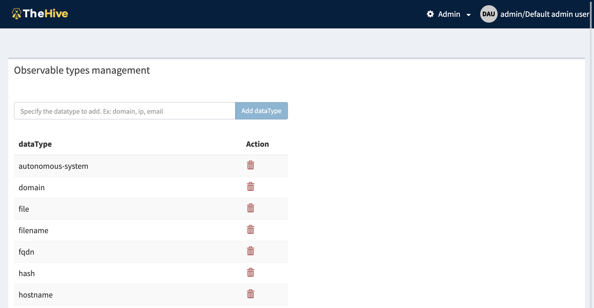

# Manage observable types

In TheHive4, we have big plans for observable types, since we plan to support observable templates insteand of a simple *string* value. But this feature is planned for the future.

In TheHive 4.0 observable datatype are common to all the organisation, and manageable by administrators (members of the *"admin"* organisation).

The management page is accessible from the header menu through the *Admin > Observable types* menu and required a use with the `manageObservableTemplate` permission (refer to [Profiles and permissions](./Profiles-permissions.md)).

