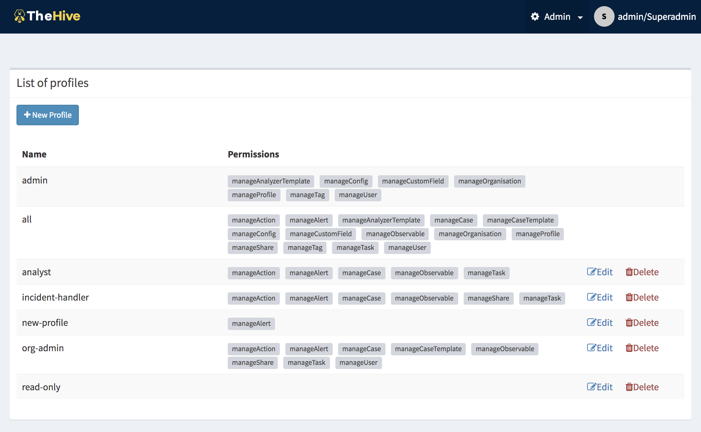
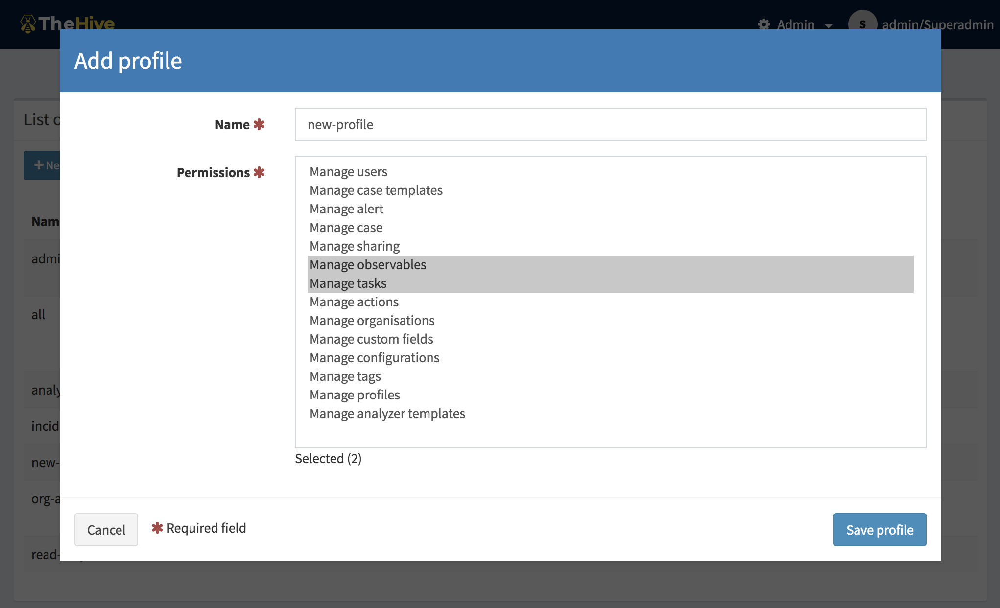

# User Profiles management

User profiles is a new concept introduced by TheHive4 and coming from the support of role based access control aka RBAC.

In TheHive4, users will be assigned a *Profile*, within an *Organisation*. A *Profile* is composed by a set of predefined permissions.

## Permissions

A *Profile* is a set of permissions attached to a *User* and an *Organisation*. It defines what the user can do on an object hold by the organisation. TheHive has a finite list of permissions:

- **manageOrganisation** (1) : the user can *create*, *update* an organisation
- **manageConfig** (1): the user can *update* configuration
- **manageProfile** (1): the user can *create*, *update* and *delete* profiles
- ***manageTag*** (1): the user can *create*, *update* and *delete* tags
- **manageCustomField** (1): the user can *create*, *update* and *delete* custom fields
- **manageCase**: the user can *create*, *update* and *delete* cases
- **manageObservable**: the user can *create*, *update* and *delete* observables
- **manageAlert**: the user can *create*, *update* and *import* alerts
- **manageUser**: the user can *create*, *update* and *delete* users
- **manageCaseTemplate**: the user can *create*, *update* and *delete* case template
- **manageTask**: the user can *create*, *update* and *delete* tasks
- **manageShare**: the user can *share* case, task and observable with other organisation
- **manageAnalyse** (2): the user can *execute* analyse
- **manageAction** (2): the user can *execute* actions
- **manageAnalyzerTemplate** (2): the user can *create*, *update* and *delete* analyzer template (previously named report template)

(1) Organisations, configuration, profiles and tags are global objects. The related permissions are effective only on *“admin”* organisation.
(2) Actions, analysis and template is available only if Cortex connector is enabled

---

**Note**

**Read** information doesn’t require specific permission. By default, users in an organisation can see all data shared with that organisation (cf. shares, discussed in [Organisations,Users and sharing](Organisations-users-sharing.md)).

---

## Profiles

We distinguish two types of profiles:

- Administration Profiles
- Organisation Profiles

The management page is accessible from the header menu through the *Admin > Profiles* menu and required a use with the `manageProfile` permission (refer to the section above).

TheHive comes with default profiles but they can be updated and removed (if not used). New profiles can be created.

Once the *New Profile* button is clicked, a dialog is opened asking for the profile type, a name for the profile and a selection of permissions. Multiple selection can be made using CTRL+click.

If it is used, a profile can’t be remove but can be updated.

Default profiles are:

- **admin**: can *manage* all global objects and users. Can’t create case.
- **analyst**: can manage cases and other related objects (observables, tasks, …), including shring them
- **org-admin**: *all* permissions *except* those related to global objects
- **read-only**: *no* permission

