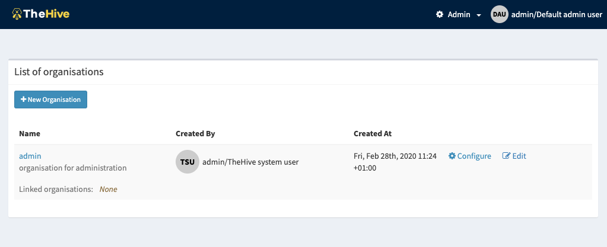
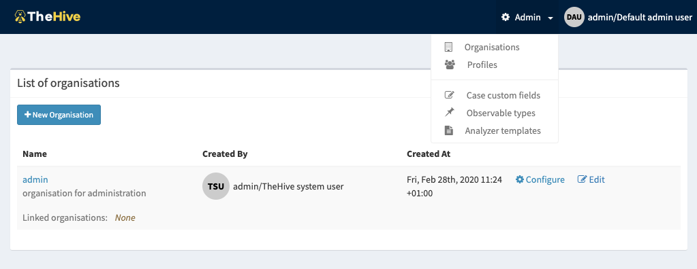
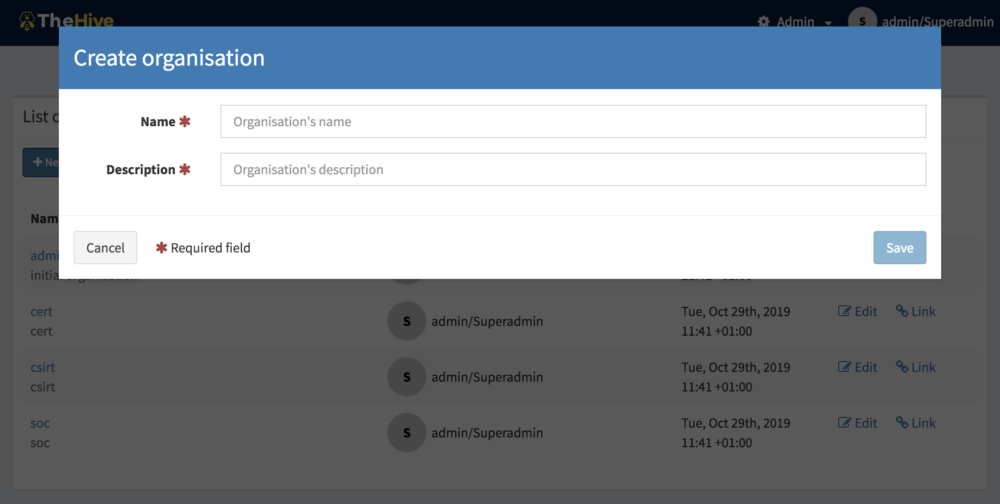
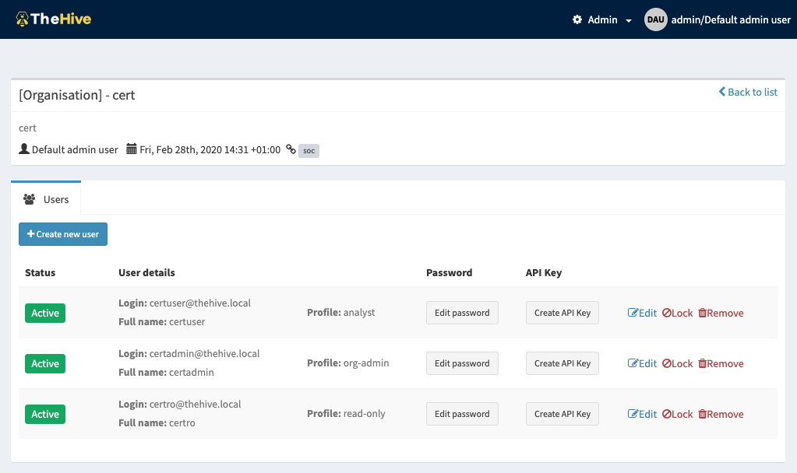
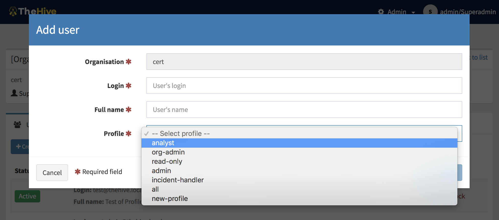
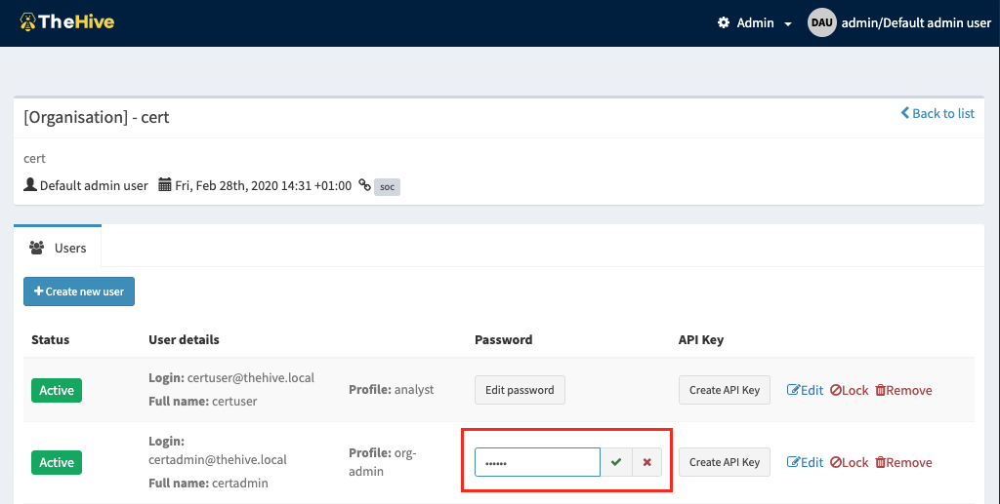
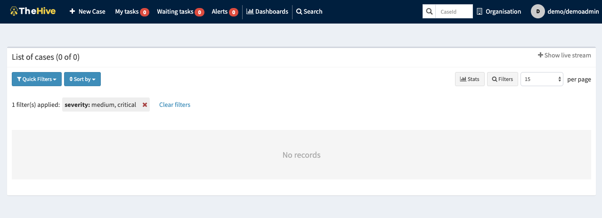
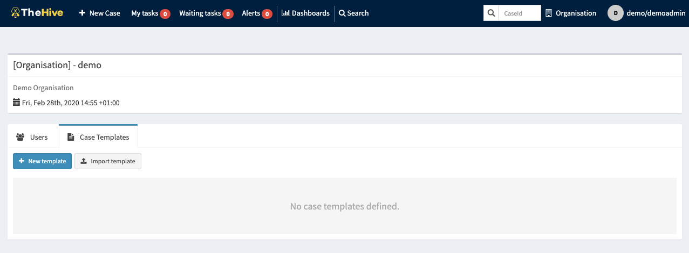

# Quick start with TheHive 4

  * [TL;DR](#tl-dr)
  * [Before starting](#before-starting)
  * [Intialize TheHive 4](#intialize-thehive-4)
    + [First login](#first-login)
    + [Create an organisation](#create-an-organisation)
    + [Create a user](#create-a-user)
    + [Login as org-admin user](#login-as-org-admin-user)

## TL;DR

0. Default administrator account: `admin@thehive.local`/`secret`
1. Login with default account
2. Create an organisaton
3. Create a user account

## Before starting

Starting from TheHive 4.0-RC1, an email address is requested, and is mandatory to register a new user, and to log in the application. 

## Intialize TheHive 4

This version of TheHive comes with a big improvement: 

- Multi-tenancy support 
- Fine grained permissions
- Customized user profiles (a set of permissions)

After TheHive installation, a default organisation called *"admin"* is created and contains the initial default super administrator user, having a profile called *"admin"*. We will discuss the *user profiles* later, but note that the *"admin"* user has all the administration permissions like:

- create organisation
- define profiles
- define observable types
- define custom fields

Members of "*admin*" organisation are dedicated to user accounts in charge of administrating the solution. 

The initial user has the following credentials:

- login: `admin@thehive.local`
  - password: `secret`

This default group cannot create and own *Cases* or any other related objects like *Tasks* or *Observables*.

### First login

When TheHive starts the first time, you need to login using the credential of the *"admin"* user indicated above (`admin@thehive.local` / `secret`), and you will be redirected to the administration home page: **List of organisations**.

Note that this organisation **cannot be deleted**.

Possible operations for the *"admin"* users (members of the *"admin"* organisation) are accessible from the "Admin" menu located on the header bar:

*admin* Organisation cannot manage Cases. so let's create an organisation and its users.

### Create an organisation

The initial action that a super admin have to make is to create the organisations (tenants) that will use TheHive to deal with incident response.

From the "List of organisations" page, hit the "New Organisation" button to open the organisation dialog. The organisation name is required and must be unique.

Hit "Save" to confirm.

###  Create a user

Once you have created an organisation you can open its details page by clicking "Configure". This organisation details page, for users with *"admin"* profile allows managing organisation users only.

You can see on this page:

- The details of the organisation: name, description, the user that created it
- A tab to manage users:
  - Create them
  - Edit their password, api key
  - Edit their profile
  - Reset their 2FA settings
  - Lock and delete them

To create a user, just click the "Create new user" button, that opens the user creation dialog.

Note: The *"Profile"* field will be populated by the profiles that can be assigned to organisation users only. (Administration profiles will not be listed).

The first user you must create for each organisation, should be a user with *"org-admin"* profile. That profile allows all the operations withing an organisation. 

A user with *"org-admin"* profile will be able to connect and configure its organisation by at least:

- Creating other users
- Creating case templates

Once you have created the users, you can set their passwords (they will be able to change them from their own account page). To do that, click on the *"New password"* button on the corresponding user's row and then hit *ENTER* or click the green check button:

### Login as org-admin user

Once the user is created, (s)he can connect to TheHive and start using it based on the profile.

Note that users with *"org-admin"* profile have an "Organisation" menu in the right side corner of the header bar given access to the organisation configuration page with and additionnal tab for case template management.

Now that the organisation and users are created, let's [define custom fields](./Custom-fields.md) and then use them to define case templates.

