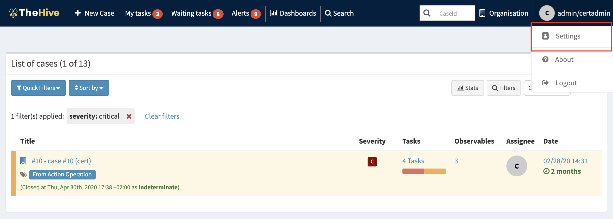
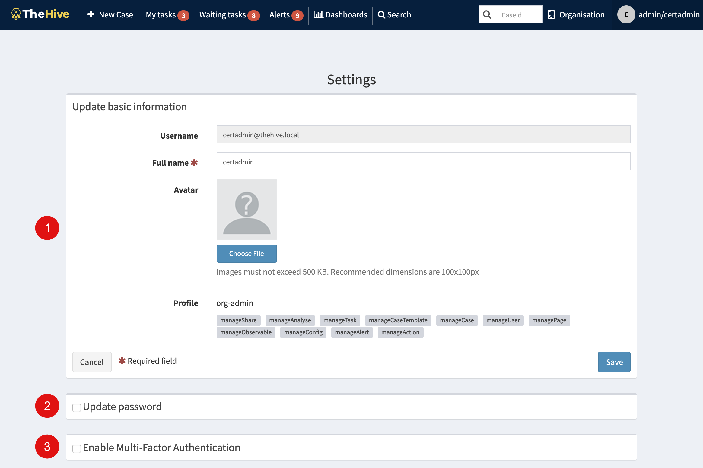
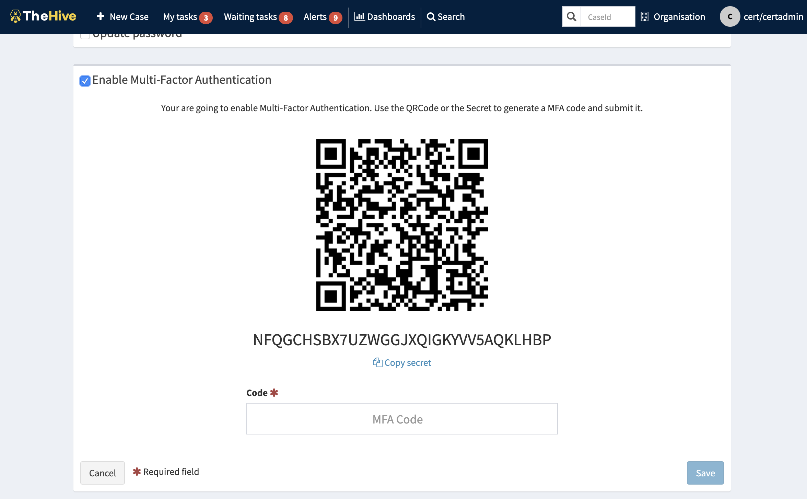
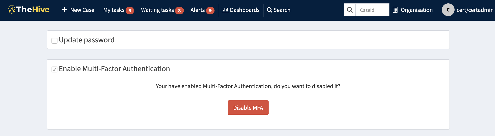
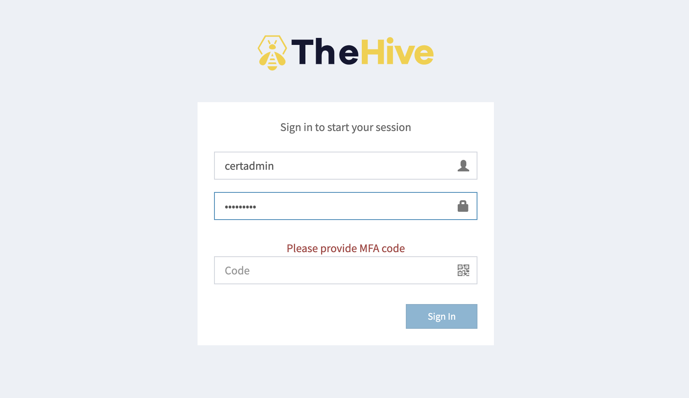

# User settings configuration

Every TheHive user, has a set of settings that can be updated through the `Settings` menu located on the right hand side of the navigation bar

This page allows the following operations:

- [Update basic info](#update-basic-info)
- [Update password](#update-password)
- [Configure MFA](#configure-mfa)

## Update basic Info

This section gives the user the ability to update the his/her name and upload an avatar image

## Update password

This section is hidden by default, the user needs to enable it, set the current password and the new one twice. Clicking _Save_ button to submit the form

## Configure MFA

This section allows a user to enable 2FA authentication using a TOTP application (Google Authenticator, Authy, Microsoft Authenticator, 1password etc.) to scan the QR code or the code underneath it.

The 2FA will generate A TOTP that the user should supply in the MFA Code area. If it is valid, 2FA will be activated.

A _Disable_ button allows the user to deactivate the 2FA settings.

A user with 2FA activated, will be prompted to provide a TOTP during login process.

