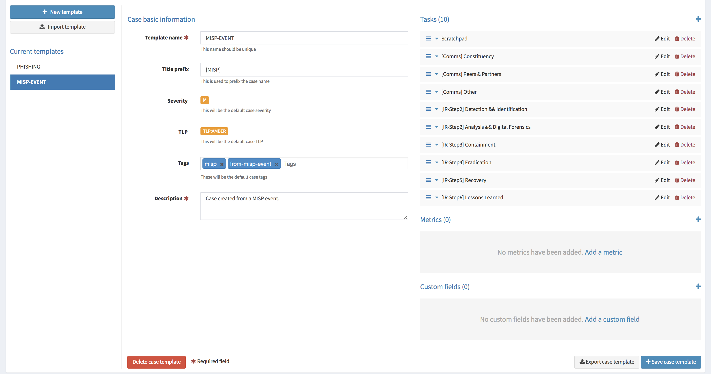

# Configuration Guide

The configuration file of TheHive is `/etc/thehive/application.conf` by default. This file uses the [HOCON format](https://github.com/typesafehub/config/blob/master/HOCON.md). All configuration parameters should go in this file.

You can have a look at the [default settings](default-configuration.md).

## Table of Contents
  * [1\. Database](#1-database)
  * [2\. Datastore](#2-datastore)
  * [3\. Authentication](#3-authentication)
    * [3\.1 LDAP/AD](#31-ldapad)
    * [3\.2 OAuth2/OpenID Connect](#32-oauth2openid-connect)
  * [4\. Streaming (a\.k\.a The Flow)](#4-streaming-aka-the-flow)
  * [5\. Entity size limit](#5-entity-size-limit)
  * [6\. Cortex](#6-cortex)
  * [7\. MISP](#7-misp)
    * [7\.1 Configuration](#71-configuration)
    * [7\.2 Associate a Case Template to Alerts corresponding to MISP events](#72-associate-a-case-template-to-alerts-corresponding-to-misp-events)
    * [7\.3 Event Filters](#73-event-filters)
  * [7\.4 MISP Purpose](#74-misp-purpose)
  * [8\. HTTP Client Configuration](#8-http-client-configuration)
  * [9\. Monitoring and Performance Metrics (deprecated)](#9-monitoring-and-performance-metrics-deprecated)
  * [10\. HTTPS](#10-https)
    * [10\.1 HTTPS using a reverse proxy](#101-https-using-a-reverse-proxy)
    * [10\.2 HTTPS without reverse proxy](#102-https-without-reverse-proxy)
    * [10\.3 Strengthen security](#103-strengthen-security)

## 1. Database

TheHive uses the Elasticsearch search engine to store all persistent data. Elasticsearch is not part of TheHive package. It must be installed and configured as a standalone instance which can be located on the same machine. For more information on how to set up Elasticsearch, please refer to [Elasticsearch installation guide](https://www.elastic.co/guide/en/elasticsearch/reference/5.6/setup.html).

Three settings are required to connect to Elasticsearch:
 * the base name of the index
 * the name of the cluster
 * the address(es) and port(s) of the Elasticsearch instance

The Defaults settings are:

```
# Elasticsearch
search {
  ## Basic configuration
  # Index name.
  index = the_hive
  # ElasticSearch instance address.
  uri = "http://127.0.0.1:9200/"
  
  # Scroll keepalive
  keepalive = 1m
  # Size of the page for scroll
  pagesize = 50
  # Number of shards
  nbshards = 5
  # Number of replicas
  nbreplicas = 1
  # Arbitrary settings
  settings {
    # Maximum number of nested fields
    mapping.nested_fields.limit = 100
  }
  
  ## Authentication configuration
  #search.username = ""
  #search.password = ""

  ## SSL configuration
  #search.keyStore {
  #  path = "/path/to/keystore"
  #  type = "JKS" # or PKCS12
  #  password = "keystore-password"
  #}
  #search.trustStore {
  #  path = "/path/to/trustStore"
  #  type = "JKS" # or PKCS12
  #  password = "trustStore-password"
  #}
 }
```

If you use a different configuration, modify the parameters accordingly in the `application.conf` file.

If multiple Elasticsearch nodes are used as a cluster, you should add addresses of the master nodes in the url like this:

```
search {
    uri = http://node1:9200,node2:9200/
   ...
```

TheHive uses the http port of Elasticsearch (9200/tcp by default).

TheHive versions index schema (mapping) in Elasticsearch. Version numbers are appended to the index base name (the 8th version of the schema uses the index `the_hive_8` if `search.index = the_hive`).

When too many documents are requested to TheHive, it uses the [scroll](https://www.elastic.co/guide/en/elasticsearch/reference/5.6/search-request-scroll.html) feature: the results are retrieved through pagination. You can specify the size of the page (`search.pagesize`) and how long pages are kept in Elasticsearch ((`search.keepalive`) before purging.

## 2. Datastore

TheHive stores attachments as Elasticsearch documents. They are split in chunks and each chunk sent to Elasticsearch is identified by the hash of the entire attachment and the associated chunk number.

The chunk size (`datastore.chunksize`) can be changed but any change will only affect new attachments. Existing ones won't be changed.

An attachment is identified by its hash. The algorithm used is configurable (`datastore.hash.main`) but must not be changed after the first attachment insertion. Otherwise, previous files cannot be retrieved.

Extra hash algorithms can be configured using `datastore.hash.extra`. These hashes are not used to identify the attachment but are shown in the user interface (the hash associated to the main algorithm is also shown). If you change extra algorithms, you should inform TheHive and ask it to recompute all hashes. Please note that the associated API call is currently disabled in Buckfast (v 2.10). It will be reinstated in the next release.

Observables can contain malicious data. When you try to download an attachment from an observable (typically a file), it is automatically zipped and the resulting ZIP file is password-protected. The default password is **malware** but it can be changed with the `datastore.attachment.password` setting.

Default values are:

```
# Datastore
datastore {
  name = data
  # Size of stored data chunks
  chunksize = 50k
  hash {
    # Main hash algorithm /!\ Don't change this value
    main = "SHA-256"
    # Additional hash algorithms (used in attachments)
    extra = ["SHA-1", "MD5"]
  }
  attachment.password = "malware"
}
```

## 3. Authentication

TheHive supports local, LDAP, Active Directory (AD) or OAuth2/OpenID Connect for authentication. By default, it relies on local credentials stored in Elasticsearch.

Authentication methods are stored in the `auth.provider` parameter, which is multi-valued. When a user logs in, each authentication method is tried in order until one succeeds. If no authentication method works, an error is returned and the user cannot log in.

The default values within the configuration file are:
```
auth {
  # "provider" parameter contains authentication provider. It can be multi-valued (useful for migration)
  # available auth types are:
  # services.LocalAuthSrv : passwords are stored in user entity (in Elasticsearch). No configuration is required.
  # ad : use ActiveDirectory to authenticate users. Configuration is under "auth.ad" key
  # ldap : use LDAP to authenticate users. Configuration is under "auth.ldap" key
  # oauth2 : use OAuth/OIDC to authenticate users. Configuration is under "auth.oauth2" and "auth.sso" keys
  provider = [local]

  # By default, basic authentication is disabled. You can enable it by setting "method.basic" to true.
  #method.basic = true

  ad {
    # The Windows domain name in DNS format. This parameter is required if you do not use
    # 'serverNames' below.
    #domainFQDN = "mydomain.local"

    # Optionally you can specify the host names of the domain controllers instead of using 'domainFQDN
    # above. If this parameter is not set, TheHive uses 'domainFQDN'.
    #serverNames = [ad1.mydomain.local, ad2.mydomain.local]

    # The Windows domain name using short format. This parameter is required.
    #domainName = "MYDOMAIN"

    # If 'true', use SSL to connect to the domain controller.
    #useSSL = true
  }

  ldap {
    # The LDAP server name or address. The port can be specified using the 'host:port'
    # syntax. This parameter is required if you don't use 'serverNames' below.
    #serverName = "ldap.mydomain.local:389"

    # If you have multiple LDAP servers, use the multi-valued setting 'serverNames' instead.
    #serverNames = [ldap1.mydomain.local, ldap2.mydomain.local]

    # Account to use to bind to the LDAP server. This parameter is required.
    #bindDN = "cn=thehive,ou=services,dc=mydomain,dc=local"

    # Password of the binding account. This parameter is required.
    #bindPW = "***secret*password***"

    # Base DN to search users. This parameter is required.
    #baseDN = "ou=users,dc=mydomain,dc=local"

    # Filter to search user in the directory server. Please note that {0} is replaced
    # by the actual user name. This parameter is required.
    #filter = "(cn={0})"

    # If 'true', use SSL to connect to the LDAP directory server.
    #useSSL = true
  }

  oauth2 {
    # URL of the authorization server
    #clientId = "client-id"
    #clientSecret = "client-secret"
    #redirectUri = "https://my-thehive-instance.example/api/ssoLogin"
    #responseType = "code"
    #grantType = "authorization_code"

    # URL from where to get the access token
    #authorizationUrl = "https://auth-site.com/OAuth/Authorize"
    #tokenUrl = "https://auth-site.com/OAuth/Token"

    # The endpoint from which to obtain user details using the OAuth token, after successful login
    #userUrl = "https://auth-site.com/api/User"
    #scope = ["openid profile"]
  }

  # Single-Sign On
  sso {
    # Autocreate user in database?
    #autocreate = false

    # Autoupdate its profile and roles?
    #autoupdate = false

    # Autologin user using SSO?
    #autologin = false
    # Attributes mappings
    #attributes {
    #  login = "sub"
    #  name = "name"
    #  groups = "groups"
    #  #roles = "roles"
    #}

    # Name of mapping class from user resource to backend user ('simple' or 'group')
    #mapper = group
    # Default roles for users with no groups mapped ("read", "write", "admin")
    #defaultRoles = []

    #groups {
    #  # URL to retrieve groups (leave empty if you are using OIDC)
    #  #url = "https://auth-site.com/api/Groups"
    #  # Group mappings, you can have multiple roles for each group: they are merged
    #  mappings {
    #    admin-profile-name = ["admin"]
    #    editor-profile-name = ["write"]
    #    reader-profile-name = ["read"]
    #  }
    #}
  }
}

# Maximum time between two requests without requesting authentication
session {
  warning = 5m
  inactivity = 1h
}
```


### 3.1. LDAP/AD
To enable authentication using AD or LDAP, edit the `application.conf` file and supply the values for your environment. Then you need to create an account on TheHive for each AD or LDAP user in `Administration > Users` page (which can only be accessed by an administrator). This is required as TheHive needs to look up the role associated with the user and that role is stored locally by TheHive. Obviously, you don't need to supply a password as TheHive will check the credentials against the remote directory.

In order to use SSL on LDAP or AD, TheHive must be able to validate remote certificates. To that end, the Java truststore must contain certificate authorities used to generate the AD and/or LDAP certificates. The Default JVM truststore contains the main official authorities but LDAP and AD certificates are probably not issued by them.

Use [keytool](https://docs.oracle.com/javase/8/docs/technotes/tools/unix/keytool.html) to create the truststore:
```
keytool -import -file /path/to/your/ca.cert -alias InternalCA -keystore /path/to/your/truststore.jks
```

Then add `-Djavax.net.ssl.trustStore=/path/to/your/truststore.jks` parameter when you start TheHive or put it in the `JAVA_OPTS` environment variable before starting TheHive.

### 3.2. OAuth2/OpenID Connect
To enable authentication using OAuth2/OpenID Connect, edit the `application.conf` file and supply the values of `auth.oauth2` according to your environment. In addition, you need to supply:

- `auth.sso.attributes.login`: name of the attribute containing the OAuth2 user's login in retreived user info (mandatory)
- `auth.sso.attributes.name`: name of the attribute containing the OAuth2 user's name in retreived user info (mandatory)
- `auth.sso.attributes.groups`: name of the attribute containing the OAuth2 user's groups (mandatory using groups mappings)
- `auth.sso.attributes.roles`: name of the attribute containing the OAuth2 user's roles in retreived user info (mandatory using simple mapping)

##### Important notes

Authenticate the user using an external OAuth2 authenticator server. The configuration is:

- clientId (string) client ID in the OAuth2 server.
- clientSecret (string) client secret in the OAuth2 server.
- redirectUri (string) the url of TheHive AOuth2 page (.../api/ssoLogin).
- responseType (string) type of the response. Currently only "code" is accepted.
- grantType (string) type of the grant. Currently only "authorization_code" is accepted.
- authorizationUrl (string) the url of the OAuth2 server.
- authorizationHeader (string) prefix of the authorization header to get user info: Bearer, token, ...
- tokenUrl (string) the token url of the OAuth2 server.
- userUrl (string) the url to get user information in OAuth2 server.
- scope (list of string) list of scope.

##### Example

```
auth {
		
  provider = [local, oauth2]

  [..]

  sso {
    autocreate: false
    autoupdate: false
    mapper: "simple"
    attributes {
      login: "login"
      name: "name"
      roles: "role"
    }
    defaultRoles: ["read", "write"]
    defaultOrganization: "demo"
  }  
  oauth2 {
    name: oauth2
    clientId: "Client_ID"
    clientSecret: "Client_ID"
    redirectUri: "http://localhost:9000/api/ssoLogin"
    responseType: code
    grantType: "authorization_code"
    authorizationUrl: "https://github.com/login/oauth/authorize"
    authorizationHeader: "token"
    tokenUrl: "https://github.com/login/oauth/access_token"
    userUrl: "https://api.github.com/user"
    scope: ["user"]
  }

  [..]	
}
```


#### 3.2.1. Roles mappings
You can choose a roles mapping with the `auth.sso.mapper` parameter. The available options are `simple` and `group`:

- Using simple mapping, we assume that the user info retrieved from `auth.oauth2.userUrl` contains the roles associated to the OAuth2 user. They can be: `read`, `write` or `admin`.
- Using groups mappings, we assume the retrieved user info contains groups that have to be associated to internal roles. In that case, you have to define mapppings in `auth.sso.groups.mappings`. If a user has multiple groups, mapped roles are merged. If you need to retreive groups from another endpoint that the one used for user info, you can provide it in `auth.sso.groups.url`.

The retrieved groups can be a valid JSON array or a string listing them:
```
{
  "sub":    "userid1",
  "name":   "User name 1",
  "groups": ["admin-profile-name", "reader-profile-name"]
}

OR

{
  "sub":    "userid2",
  "name":   "User name 2",
  "groups": "[admin-profile-name, reader-profile-name, \"another profile\", 'a last group']"
}

OR

{
  "sub":    "userid3",
  "name":   "User name 3",
  "groups": "the-only-group-of-the-user"
}
```

Finally, you can setup default roles associated with user with no roles/groups retrieved, using the `auth.sso.defaultRoles` parameter.

#### 3.2.2. User autocreation, autoupdate and autologin
The main advantage of OAuth2/OpenID Connect authentication is you won't need to create an account on TheHive for each OAuth2 user if you set the config parameter `auth.sso.autocreate` to `true`. However, by default, OAuth2 users won't be updated on SSO login unless you set `auth.sso.autoupdate` to `true`. If you set this last parameter, roles and name will be fetched from retrieved user info and will be updated in local database on each login of the user.

With `auth.sso.autologin` set to `true`, each user connecting to TheHive will automatically be redirected to `auth.oauth2.authorizationUrl`. The only way to authenticate in TheHive using a local user will be either:

- Connecting to TheHive using `https://my-hive-instance.com/index.html#!/login?code=BAD_CODE`. You will get an `Authentication Failure` but will then be able to authenticate.
- Connecting to TheHive using a real OAuth2 account, then disconnect. On disconnection, you won't be redirected to authorization URL.

#### 3.2.3. Debugging
To debug the OAuth2 feature, you can uncomment the following lines in `/etc/thehive/logback.xml`:
```
<!-- Uncomment the next lines to log debug information for OAuth/OIDC login -->
<logger name="org.elastic4play.services.auth" level="DEBUG" />
<logger name="services.OAuth2Srv" level="DEBUG" />
<logger name="services.mappers" level="DEBUG" />
```

## 4. Streaming (a.k.a The Flow)
The user interface is automatically updated when data is changed in the back-end. To do this, the back-end sends events to all the connected front-ends. The mechanism used to notify the front-end is called long polling and its settings are:

* `refresh` : when there is no notification, close the connection after this duration (the default is 1 minute).
* `cache` : before polling a session must be created, in order to make sure no event is lost between two polls. If there is no poll during the `cache` setting, the session is destroyed (the default is 15 minutes).
* `nextItemMaxWait`, `globalMaxWait` :  when an event occurs, it is not immediately sent to the front-ends. The back-end waits `nextItemMaxWait` and up to `globalMaxWait` in case another event can be included in the notification. This mechanism saves many HTTP requests.

Default values are:
```
# Streaming
stream.longpolling {
  # Maximum time a stream request waits for new element
  refresh = 1m
  # Lifetime of the stream session without request
  cache = 15m
  nextItemMaxWait = 500ms
  globalMaxWait = 1s
}
```

## 5. Entity size limit
The Play framework used by TheHive sets the HTTP body size limit to 100KB by default for textual content (json, xml, text, form data) and 10MB for file uploads. This could be too small in most cases so you may want to change it with the following settings in the `application.conf` file:

```
# Max textual content length
play.http.parser.maxMemoryBuffer=1M
# Max file size
play.http.parser.maxDiskBuffer=1G
```

*Note*: if you are using a NGINX reverse proxy in front of TheHive, be aware that it doesn't distinguish between text data and a file upload. So, you should also set the `client_max_body_size` parameter in your NGINX server configuration to the highest value among the two: file upload and text size defined in TheHive `application.conf` file.

## 6. Cortex
TheHive can use one or several [Cortex](https://github.com/TheHive-Project/Cortex) analysis engines to get additional information on observables. When configured, analyzers available in Cortex become usable on TheHive. First you must enable `CortexConnector`, choose an identifier then specify the URL for each Cortex server:
```
## Enable the Cortex module
play.modules.enabled += connectors.cortex.CortexConnector

cortex {
  "CORTEX-SERVER-ID" {
    # URL of the Cortex server
    url = "http://CORTEX_SERVER:CORTEX_PORT"
    # Key of the Cortex user, mandatory for Cortex 2
    key = "API key"
  }
  # HTTP client configuration, more details in section 8
  # ws {
  #   proxy {}
  #   ssl {}
  # }
  # Check job update time interval
  refreshDelay = 1 minute
  # Maximum number of successive errors before give up
  maxRetryOnError = 3
  # Check remote Cortex status time interval
  statusCheckInterval = 1 minute
}
```

If you connect TheHive with Cortex 2, you must create a user in Cortex with the `read, analyze` roles, set an API key and add this key in the Cortex server definition in TheHive `application.conf`. For Cortex 1, authentication is not required, the key is not used.

To create a user with the `read, analyze` role in Cortex 2, you must have at least one organization configured then you can connect to the Cortex 2 Web UI using a `orgAdmin` account for that organization to create the user and generate their API key. Please refer to the Cortex [Quick Start Guide](https://github.com/TheHive-Project/CortexDocs/blob/master/admin/quick-start.md#step-7-optional-create-an-account-for-thehive-integration) for more information.

Cortex analyzes observables and outputs reports in JSON format. TheHive shows the report as-is by default. In order to make reports more readable, we provide report templates which are in a separate package and must be installed manually:
 - download the report template package from https://dl.bintray.com/thehive-project/binary/report-templates.zip
 - log in TheHive using an administrator account
 - go to `Admin` > `Report templates` menu
 - click on `Import templates` button and select the downloaded package

HTTP client used by Cortex connector use global configuration (in `play.ws`) but can be overridden in Cortex section and in each Cortex server configuration. Refer to section 8 for more detail on how to configure HTTP client.

## 7. MISP
TheHive has the ability to connect to one or several MISP instances in order to import and export events. Hence TheHive is able to:

- receive events as they are added or updated from multiple MISP instances. These events will appear within the `Alerts` pane.
- export cases as MISP events to one or several MISP instances. The exported cases will not be published automatically though as they need to be reviewed prior to publishing. We **strongly** advise you to review the categories and types of attributes at least, before publishing the corresponding MISP events.

**Note**: Please note that only and all the observables marked as IOCs will be used to create the MISP event. Any other observable will not be shared. This is not configurable.

Within the configuration file, you can register your MISP server(s) under the `misp` configuration keyword. Each server shall be identified using an arbitrary name, its `url`, the corresponding authentication `key` and optional `tags` to add each observable created from a MISP event. Any registered server will be used to import events as alerts. It can also be used to export cases to as MISP events, if the account used by TheHive on the MISP instance has sufficient rights.

This means that TheHive can import events from configured MISP servers _**and**_ export cases to the same configured MISP servers. Having different configuration for sources and destination servers is expected in a future version.

##### Important Notes

**TheHive requires MISP 2.4.73 or better**. Make sure that your are using a compatible version of MISP before reporting problems. MISP 2.4.72 and below do not work correctly with TheHive.


### 7.1 Configuration
To sync with a MISP server and retrieve events or export cases, edit the `application.conf` file and adjust the example shown below to your setup:

```
## Enable the MISP module (import and export)
play.modules.enabled += connectors.misp.MispConnector

misp {
  "MISP-SERVER-ID" {
    # URL of the MISP instance.
    url = "<The_URL_of_the_MISP_Server_goes_here>"

    # Authentication key.
    key = "<the_auth_key_goes_here>"

    # Name of the case template created in TheHive that shall be used to import
    # MISP events as cases by default.
    caseTemplate = "<Template_Name_goes_here>"

    # Tags to add to each observable imported from an event available on
    # this instance.
    tags = ["misp-server-id"]

    # Truststore to use to validate the X.509 certificate  of  the  MISP
    # instance if the default truststore is not sufficient.
    #ws.ssl.trustManager.stores = [
    #{
    #  type: "JKS"
    #  path: "/path/to/truststore.jks"
    #}
    #]

    # HTTP client configuration, more details in section 8
    # ws {
    #   proxy {}
    #   ssl {}
    # }

    # filters:
    max-attributes = 1000
    max-size = 1 MiB
    max-age = 7 days
    exclusion {
     organisation = ["bad organisation", "other orga"]
     tags = ["tag1", "tag2"]
    }
    whitelist.tags = ["whitelist-tag1", "whitelist-tag2"]

    # MISP purpose defines if this instance can be used to import events (ImportOnly), export cases (ExportOnly) or both (ImportAndExport)
    # Default is ImportAndExport
    purpose = ImportAndExport
  }

  # Check remote TheHive status time interval
  statusCheckInterval = 1 minute

  # Interval between consecutive MISP event  imports  in  hours  (h)  or
  # minutes (m).
  interval = 1h
}
```

The HTTP client used by the MISP connector uses a global configuration (in `play.ws`) but it can be overridden within the MISP section of the configuation file and/or in the configuration section of each MISP server (in `misp.MISP-SERVER-ID.ws`). Refer to section 8 for more details on how to configure the HTTP client.

### 7.2 Associate a Case Template to Alerts corresponding to MISP events
As stated in the subsection above, TheHive is able to automatically import MISP events (they will appear as alerts within the `Alerts` pane) and create cases out of them. This operation leverages the template engine. Thus you'll need to create a case template prior to importing MISP events.

First, create a case template. Let's call it **MISP-EVENT**.



Then update TheHive's configuration to add a 'caseTemplate' parameter as shown in the example below:

```
misp {
  "MISP-SERVER-ID" {
    # URL of the MISP server
    url = "<The_URL_of_the_MISP_Server_goes_here>"
    # authentication key
    key = "<the_auth_key_goes_here>"
    # tags that must be automatically added to the case corresponding to the imported event
    tags = ["misp"]
    # case template
    caseTemplate = "MISP-EVENT"
  }

```

Once the configuration file has been edited, restart TheHive. Every new import of a MISP event will generate a case using to the *MISP-EVENT* template by default. The template can be overridden though during the event import.

MISP events will only be imported by TheHive if they have at least one attribute and were published.

### 7.3 Event Filters
When you first connect TheHive to a MISP instance, you can be overwhelmed by the number of alerts that will be generated, particularly if the MISP instance contains a lot of events. Indeed, every event, even those that date back to the beginning of the Internet, will generate an alert. To avoid alert fatigue, and starting from TheHive 3.0.4 (Cerana 0.4), you can exclude MISP events using different filters:

 - the maximum number of attributes (max-attributes)
 - the maximum size of the event's JSON message (max-size)
 - the maximum age of the last publication (max-age)
 - the organisation is black-listed (exclusion.organisation)
 - one of the tags is black-listed (exclusion.tags)
 - doesn't contain one of the whitelist tag (whitelist.tags)

Please note that MISP event filters can be adapted to the configuration associated to each MISP server TheHive is connected with. As regards the `max-age` filter, it applies to the publication date of MISP events and not to the creation date.

In the example below, the following MISP events won't generate alerts in TheHive:

- events that have more than 1000 attributes
- events which JSON message size is greater than 1MB
- events that have been published more than one week from the current date
- events that have been created by `bad organisation` or `other orga`
- events that contain `tag1` or `tag2`

```
    # filters:
    max-attributes = 1000
    max-size = 1 MiB
    max-age = 7 days
    exclusion {
     organisation = ["bad organisation", "other orga"]
     tags = ["tag1", "tag2"]
    }
```

Of course, you can omit some of the filters or all of them.

## 7.4 MISP Purpose
TheHive can interact with MISP in two ways: import a MISP event to create a case in TheHive and export a TheHive case to create a MISP event. By default, any MISP instance that is added to TheHive's configuration will be used for importing events and exporting cases (`ImportAndExport`). If you want to use MISP in only one way, you can set its purpose in the configuration as `ImportOnly` or `ExportOnly`.

Starting from TheHive 3.3, when exporting a case to a MISP instance, you can export all its tags to the freshly created MISP event. This behaviour is not enabled by default. If you want to enable it you must set the `exportCaseTags` variable to `true` as shown below:

```
misp {
  "local" {
    url = "http://127.0.0.1"
    key = "<the_auth_key_goes_here>"
    exportCaseTags = true
    [...] # additional parameters go here
  }
}

```

## 8. HTTP Client Configuration

HTTP client can be configured by adding `ws` key in sections that needs to connect to remote HTTP service. The key can contain configuration items defined in [play WS configuration](https://www.playframework.com/documentation/2.6.x/ScalaWS#Configuring-WS):

 - `ws.followRedirects`: Configures the client to follow 301 and 302 redirects (default is true).
 - `ws.useragent`: To configure the User-Agent header field.
 - `ws.compressionEnabled`: Set it to true to use gzip/deflater encoding (default is false).

#### Timeouts
There are 3 different timeouts in WS. Reaching a timeout causes the WS request to interrupt.
 - `ws.timeout.connection`: The maximum time to wait when connecting to the remote host (default is 120 seconds).
 - `ws.timeout.idle`: The maximum time the request can stay idle (connection is established but waiting for more data) (default is 120 seconds).
 - `ws.timeout.request`: The total time you accept a request to take (it will be interrupted even if the remote host is still sending data) (default is 120 seconds).

#### Proxy
Proxy can be used. By default, the proxy configured in JVM is used but one can configured specific configurations for each HTTP client.
 - `ws.useProxyProperties`: To use the JVM system’s HTTP proxy settings (http.proxyHost, http.proxyPort) (default is true). This setting is ignored if `ws.proxy` settings is present.
 - `ws.proxy.host`: The hostname of the proxy server.
 - `ws.proxy.post`: The port of the proxy server.
 - `ws.proxy.protocol`: The protocol of the proxy server.  Use "http" or "https".  Defaults to "http" if not specified.
 - `ws.proxy.user`: The username of the credentials for the proxy server.
 - `ws.proxy.password`: The password for the credentials for the proxy server.
 - `ws.proxy.ntlmDomain`: The password for the credentials for the proxy server.
 - `ws.proxy.encoding`: The realm's charset.
 - `ws.proxy.nonProxyHosts`: The list of hosts on which proxy must not be used.

#### SSL
SSL of HTTP client can be completely configured in `application.conf` file.

##### Certificate manager
Certificate manager is used to store client certificates and certificate authorities.

`keyManager` indicates which certificate HTTP client can use to authenticate itself on remote host (when certificate based authentication is used)
```
  ws.ssl.keyManager {
    stores = [
      {
        type: "pkcs12" // JKS or PEM
        path: "mycert.p12"
        password: "password1"
      }
    ]
  }
```
Certificate authorities are configured using `trustManager` key. It is used to establish a secure connection with remote host. Server certificate must be signed by a trusted certificate authority.
```
  ws.ssl.trustManager {
    stores = [
      {
        type: "JKS" // JKS or PEM
        path: "keystore.jks"
        password: "password1"
      }
    ]
  }
```
##### Debugging
To debug the key manager / trust manager, set the following flags:
```
  ws.ssl.debug = {
    ssl = true
    trustmanager = true
    keymanager = true
    sslctx = true
    handshake = true
    verbose = true
    data = true
    certpath = true
  }
```

##### Protocols
If you want to define a different default protocol, you can set it specifically in the client:
```
ws.ssl.protocol = "TLSv1.2"
```
If you want to define the list of enabled protocols, you can do so explicitly:
```
ws.ssl.enabledProtocols = ["TLSv1.2", "TLSv1.1", "TLSv1"]
```
##### Ciphers
Cipher suites can be configured using `ws.ssl.enabledCipherSuites`:
```
ws.ssl.enabledCipherSuites = [
  "TLS_DHE_RSA_WITH_AES_128_GCM_SHA256",
  "TLS_ECDHE_RSA_WITH_AES_128_GCM_SHA256",
  "TLS_DHE_RSA_WITH_AES_256_GCM_SHA384",
  "TLS_ECDHE_RSA_WITH_AES_256_GCM_SHA384",
]
```

## 9. Monitoring and Performance Metrics (deprecated)

Performance metrics (response time, call rate to Elasticsearch and HTTP request, throughput, memory used...) can be collected if enabled in configuration.

Enable it by editing the `application.conf` file, and add:

```
# Register module for dependency injection
play.modules.enabled += connectors.metrics.MetricsModule

metrics.enabled = true
```

These metrics can optionally be sent to an external database (graphite, ganglia or influxdb) in order to monitor the health of the platform. This feature is disabled by default.

```
metrics {
    name = default
    enabled = true
    rateUnit = SECONDS
    durationUnit = SECONDS
    showSamples = false
    jvm = true
    logback = true

    graphite {
        enabled = false
        host = "127.0.0.1"
        port = 2003
        prefix = thehive
        rateUnit = SECONDS
        durationUnit = MILLISECONDS
        period = 10s
    }

    ganglia {
        enabled = false
        host = "127.0.0.1"
        port = 8649
        mode = UNICAST
        ttl = 1
        version = 3.1
        prefix = thehive
        rateUnit = SECONDS
        durationUnit = MILLISECONDS
        tmax = 60
        dmax = 0
        period = 10s
    }

    influx {
        enabled = false
        url = "http://127.0.0.1:8086"
        user = root
        password = root
        database = thehive
        retention = default
        consistency = ALL
        #tags = {
        #    tag1 = value1
        #    tag2 = value2
        #}
        period = 10s
    }
}
```
## 10. HTTPS
You can enable HTTPS on TheHive application or add a reverse proxy in front of TheHive. The latter solution is recommended.

### 10.1 HTTPS using a reverse proxy
You can choose any reverse proxy to add SSL on TheHive. Below an example of NGINX configuration:
```
	server {
			listen 443 ssl;
			server_name thehive.example.com;

			ssl_certificate			ssl/thehive_cert.pem;
			ssl_certificate_key		ssl/thehive_key.pem;

			proxy_connect_timeout   600;
			proxy_send_timeout      600;
			proxy_read_timeout      600;
			send_timeout            600;
			client_max_body_size    2G;
			proxy_buffering off;
			client_header_buffer_size 8k;

			location / {
					add_header				Strict-Transport-Security "max-age=31536000; includeSubDomains";
					proxy_pass              http://127.0.0.1:9000/;
					proxy_http_version      1.1;
					proxy_set_header Connection ""; # cf. https://github.com/akka/akka/issues/19542
			}
	}
```

### 10.2 HTTPS without reverse proxy

This is not supported.

### 10.3 Strengthen security
When SSL is enable (with reverse proxy or not), you can configure cookie to be "secure" (usable only with HTTPS protocol). This is done by adding `play.http.session.secure=true` in the application.conf file.

You can also enable [HSTS](https://en.wikipedia.org/wiki/HTTP_Strict_Transport_Security). This header must be configured on the SSL termination component.
For NGINX, use `add_header` directive, as show above.
