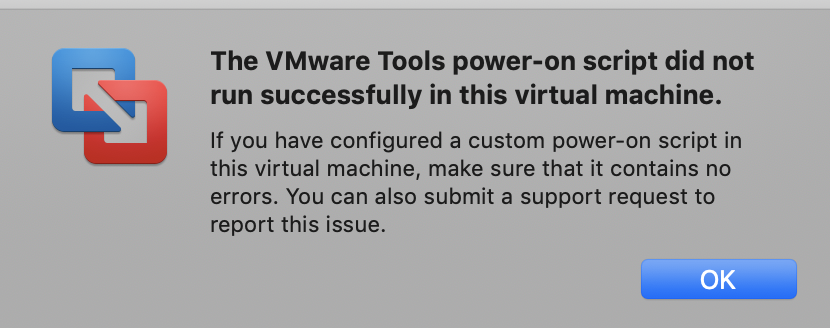

## Training Material
TheHive Project maintains a training virtual machine (OVA) containing TheHive, Cortex and Cortex analyzers with all dependencies and ElasticSearch installed on top of Ubuntu 18.04 with Oracle JRE 8.

As of this writing, the training VM includes TheHive 3.2.1, Cortex 2.1.3, TheHive4py 1.6.0, Cortex4py 2.0.1 and any available Cortex analyzer as of Jan 12, 2019.

**Warning**: The training VM is solely intended to be used for testing or training purposes. **We strongly encourage you to refrain from using it in production**.

### TL;DR

- Training VM system account : `thehive/thehive1234`
- TheHive URL : http://IP_OF_VM:9000
- Cortex URL : http://IP_OF_VM:9001
- Cortex superAdmin account : `admin/thehive1234`
- Cortex "training" Org admin account  : `thehive/thehive1234` (its key API is used to enable Cortex service in TheHive)

### Get It

You can download the VM from the following location:

[https://drive.google.com/open?id=1KXL7kzH7Pc2jSL2o1m1_RwVc3FGw-ixQ](https://drive.google.com/open?id=1KXL7kzH7Pc2jSL2o1m1_RwVc3FGw-ixQ)

To ensure that your download went through nicely, **check the file’s SHA256 hash** which must be equal to the following value:

`387e8a62a82d56fb6fac3f63630733afb98d9c1f4e5f17056d19bc6a82670675`

**Note**: On starting the newly imported VM from OVA file in VMware Fusion, you may encounter a message regarding an error with VMWare tools. . By clicking on the `OK` button you would be able to use the VM as expected.

#### Previous Version

The previous version of the training VM, TheHive 3.1.2, Cortex 2.1.2, TheHive4py 1.5.1, Cortex4py 2.0.1 and any available Cortex analyzer as of Oct 14, 2018 is still available at the following address:

[https://drive.google.com/open?id=0B3G-Due88gfQNEtPOW16Z3ZhUlU](https://drive.google.com/open?id=0B3G-Due88gfQNEtPOW16Z3ZhUlU)

To ensure that your download went through nicely, **check the file’s SHA256 hash** which must be equal to the following value:

`f139cc9d5b0200b4c234b6ac85273d9c1932abf326b53e0e940712b59be6892a`

#### Beta Version

A training VM containing beta versions of TheHive (TheHive 3.3.0-RC5), Cortex (Cortex 2.1.3), TheHive4py( thehive4py 1.6.0) and Cortex4py (cortex4py 2.0.1) is also available. You can download this VM from the following location:

[https://drive.google.com/open?id=1KqLIaABfzPz40j_-MAH1F0ozFLyzIICZ](https://drive.google.com/open?id=1KqLIaABfzPz40j_-MAH1F0ozFLyzIICZ)

To ensure that your download went through nicely, **check the file’s SHA256 hash** which must be equal to the following value:

`aae695e927a920ae6887d1525dcb7ab917ced17889fd21aff16ce2f655c79e03`

### Use It

To access TheHive, point your browser to the following URL:

[http://IP_OF_VM:9000](http://IP_OF_VM:9000)

To access Cortex, point your browser to the following URL:

[http://IP_OF_VM:(9001)](http://IP_OF_VM:9001)

#### Configure TheHive

The first time you access TheHive, you’ll need to create the associated database by clicking on the `Update Database` button as shown below:

TheHive’s configuration file is located in `/etc/thehive/application.conf`. For additional configuration, [read the documentation](README.md).

**Note** : after the first login into TheHive, if the Cortex health check fails (look at the Cortex icon at the bottom right side of the UI), it should success after fully reloading the web page. 

#### Configure Cortex

Cortex is already configured with a superAdmin account `admin/thehive1234`. An organization `training` is also pre-installed with an account `thehive/thehive1234`. This account has `read/analyze/orgAdmin` privileges and TheHive is already configured to use the Cortex service with its key API.

#### Update Analyzers and Use their Report Templates

With the new version, analyzers are disabled by default. The training VM is delivered with _Abuse Finder_, _File_Info_, _Msg_Parser_ and _MaxMind GeoIP_ enabled.

To fully benefit from the latest analyzers, [update them](https://github.com/TheHive-Project/CortexDocs/blob/master/installation/install-guide.md#updating) and install the associated report templates in TheHive:

- [download the report template package](https://dl.bintray.com/thehive-project/binary/report-templates.zip)
- log in TheHive using an administrator account
- go to Admin > Report templates menu
- click on Import templates button and select the downloaded package

#### Plug it with MISP

The test VM does not contain a MISP instance and none is configured in TheHive’s configuration file.  To play with MISP, you may want to [use the VM our good friends at CIRCL provide](https://www.circl.lu/services/misp-training-materials/).  Once you’ve downloaded it or if you have an existing instance, edit `/etc/thehive/application.conf` and [follow the configuration guide](admin/configuration.md#7-misp).

#### Restart or Go Mad

After each modification of `/etc/thehive/application.conf` do not forget to restart the service:

`$ sudo service thehive restart`

After each modification of `/etc/cortex/application.conf` do not forget to restart the service:

`$ sudo service cortex restart`

#### Troubles?

TheHive service logs are located in `/var/log/thehive/application.log`.

Cortex service logs are located in `/var/log/cortex/application.log`.

#### Need Help?

Something does not work as expected? No worries, we got you covered. Please join our  [user forum](https://groups.google.com/a/thehive-project.org/forum/#!forum/users), contact us on [Gitter](https://gitter.im/TheHive-Project/TheHive), or send us an email at [support@thehive-project.org](mailto:support@thehive-project.org). We are here to help.
