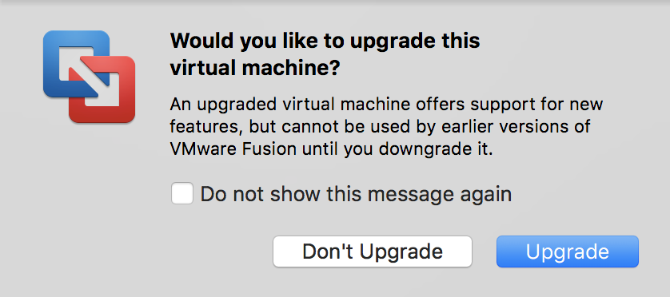

## Training Material
TheHive Project maintains a training virtual machine (OVA) containing TheHive, Cortex and Cortex analyzers with all dependencies and ElasticSearch installed on top of Ubuntu 16.04 with Oracle JRE 8.

As of this writing, the training VM includes Cerana 0.3 (TheHive 3.0.3), Cortex 1.1.4, TheHive4py 1.4.1, Cortex4py 1.0.0 and the latest Cortex analyzers as of Dec 22, 2017.

**Warning**: The training VM is solely intended to be used for testing or training purposes. **We strongly encourage you to refrain from using it in production**.

### Get It

You can download the VM from the following location:

[https://drive.google.com/open?id=0B3G-Due88gfQMTlrTXF3ZnBIRTA](https://drive.google.com/open?id=0B3G-Due88gfQMTlrTXF3ZnBIRTA)

To ensure that your download went through nicely, **check the file’s SHA256 hash** which must be equal to the following value:

`86a87b70627e8db672c57cb57821461f2564ae9b8087cc22fdd1e7a599c16aed`

The system’s login is `thehive` and the associated password is `thehive1234`.

**Note**: On starting the newly imported VM from OVA file in VMware Fusion, you may encounter a message asking to upgrade the virtual machine. By clicking on the `Upgrade` button you would be able to use the VM as expected.

### Use It

Start the VM and make sure the `/var/log/thehive` and `/var/log/cortex` directories exist. If they don't, please use the following commands to create them:

`$ sudo mkdir /var/log/thehive && sudo chown thehive:thehive /var/log/thehive && sudo service thehive restart` 

`$ sudo mkdir /var/log/cortex && sudo chown cortex:cortex /var/log/cortex && sudo service cortex restart`

To access TheHive, point your browser to the following URL:

[http://IP_OF_VM:9000](http://IP_OF_VM:9000)

To access Cortex, point your browser to the following URL:

[http://IP_OF_VM:9999](http://IP_OF_VM:9999)

### Configure TheHive

The first time you access TheHive, you’ll need to create the associated database by clicking on the `Update Database` button as shown below:

TheHive’s configuration file is located in `/etc/thehive/application.conf`. For additional configuration, [read the documentation](README.md).

#### Cortex

TheHive is already configured to use the local Cortex service.

#### Analyzer and Associated Report Templates

To fully benefit from the analyzers, you should install the associated report templates:

- [download the report template package](https://dl.bintray.com/cert-bdf/thehive/report-templates.zip)
- log in TheHive using an administrator account
- go to Admin > Report templates menu
- click on Import templates button and select the downloaded package

#### Plug it with MISP

The test VM does not contain a MISP instance and none is configured in TheHive’s configuration file.  To play with MISP, you may want to [use the VM our good friends at CIRCL provide](https://www.circl.lu/services/misp-training-materials/).  Once you’ve downloaded it or if you have an existing instance, edit `/etc/thehive/application.conf` and [follow the configuration guide](admin/configuration.md#7-misp).

#### Restart or Go Mad

After each modification of `/etc/thehive/application.conf` do not forget to restart the service:

`$ sudo service thehive restart`

#### Troubles?

TheHive service logs are located in `/var/log/thehive/application.log`.

### Configure Cortex

All available analyzers are installed with their dependencies, but none is configured. To configure analyzers, edit `/etc/cortex/application.conf` and follow the configuration guide.

#### Restart or Go Mad

After each modification of `/etc/cortex/application.conf` do not forget to restart the service:

`$ sudo service cortex restart`

#### Troubles?

Cortex service logs are located in `/var/log/cortex/application.log`.

#### Need Help?

Something does not work as expected? No worries, we got you covered. Please join our  [user forum](https://groups.google.com/a/thehive-project.org/forum/#!forum/users), contact us on [Gitter](https://gitter.im/TheHive-Project/TheHive), or send us an email at [support@thehive-project.org](mailto:support@thehive-project.org). We are here to help.
